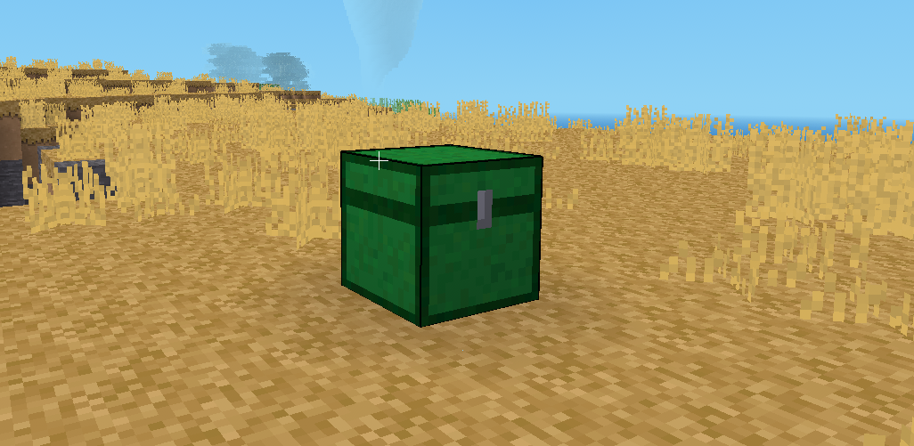
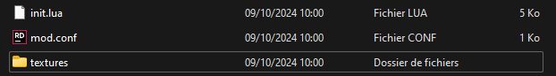

# ActiviteImpactDesMods

But : Créer un mod qui ajoute un coffre que les joueurs peuvent utiliser pour récupérer tous les objets du jeu.

## Installation de Minetest :
Télécharge la version la plus récente de Minetest depuis [minetest.net.](https://www.minetest.net/)

## Création du Dossier
Créer ensemble le dossier chest_with_everything dans minetest/mods/.

## Création de la Texture
Utiliser un logiciel de dessin (GIMP, Paint.NET) pour créer une texture 32x32 px pour le coffre.
Exposer un exemple visuel pour inspiration.
Sauvegarder ce fichier sous chest_with_everything.png dans un sous-dossier appelé textures.

## Ajout du Script Init
Présenter le script init.lua et en expliquer brièvement le contenu essentiel.
Copier le script fourni dans le fichier init.lua du mod.
[code.txt](https://github.com/user-attachments/files/17304992/code.txt)

## Ajout du Fichier de Configuration (.conf)
Créer un fichier Mod.conf pour paramétrer quelques propriétés du mod.[Mod.conf.txt](https://github.com/user-attachments/files/17305032/Mod.conf.txt)
Expliquer l'utilisation et les notions de base de ce fichier.

## Test en Jeu 
Activer le mod dans Minetest.
Lancer le jeu et vérifier le bon fonctionnement du coffre.

